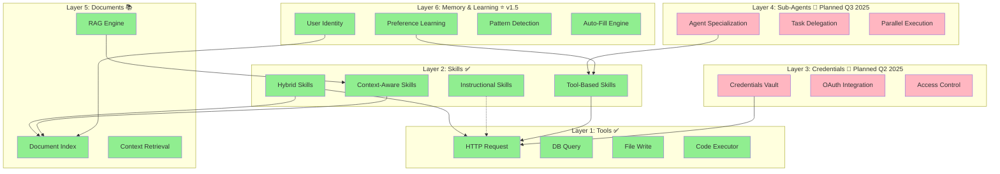
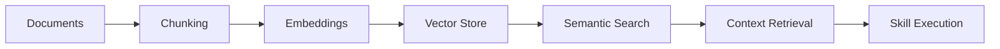
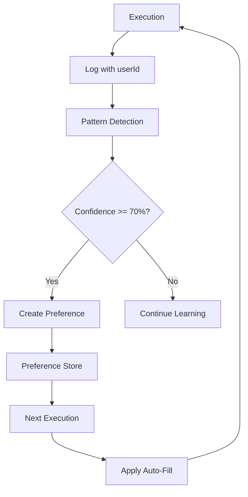
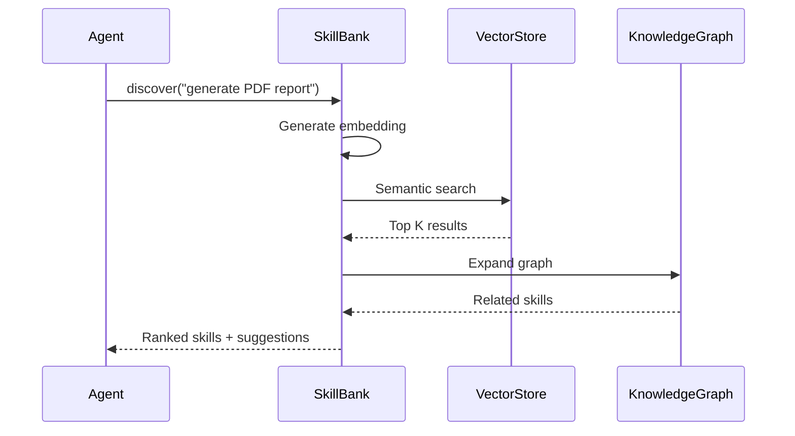
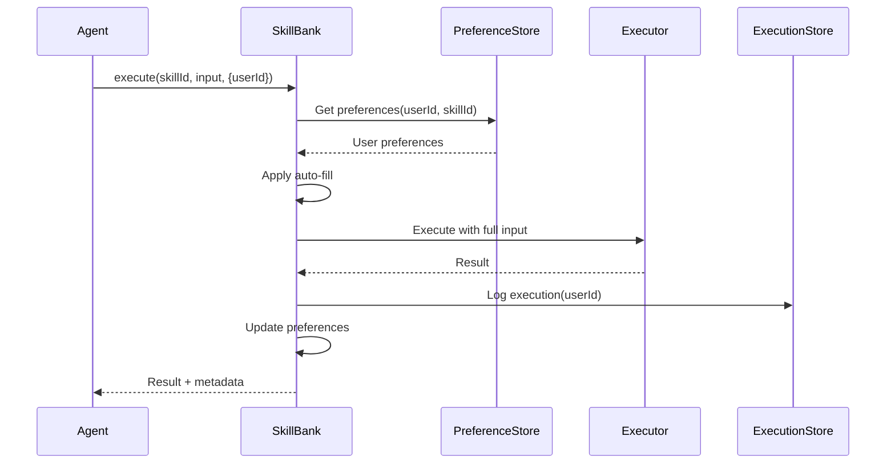
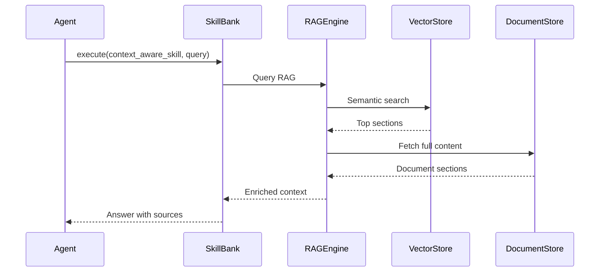

# Skill Bank Architecture

## Overview

Skill Bank is designed as a **6-layer platform** for AI agent capability management. Each layer builds on the previous, creating a coherent system from atomic tools to personalized agent behavior.

---

## 🏗️ The 6-Layer Stack



**Legend:**
- 🟢 Green: Implemented (v1.5)
- 🔴 Pink: Planned (v2.0-v4.0)

---

## 📐 Layer Details

### Layer 1: Tools (Atomic Capabilities) ✅

**Purpose:** Generic, reusable executables with no domain knowledge.

**Examples:**
- `http_request` - Make HTTP calls to any endpoint
- `db_query` - Execute SQL queries
- `file_write` - Write to filesystem
- `code_executor` - Run code snippets

**Key Principle:** Tools are **atomic and generic**. They should be maximally reusable across domains.

```typescript
// Tool definition
interface Tool {
  id: string;
  name: string;
  type: 'tool';
  category: string;
  description: string;
  parameters: Parameter[];
  outputs: Output[];
}
```

---

### Layer 2: Skills (Structured Knowledge) ✅

**Purpose:** Encode *how and when* to use tools. Domain-specific logic, workflows, and best practices.

**4 Types:**

1. **Tool-Based** - Orchestrate external tools
   - Example: `stripe_api_handler`
   - Uses: `http_request` tool

2. **Instructional** - Use LLM native capabilities
   - Example: `create_cornell_notes`
   - Uses: No external tools, pure LLM

3. **Context-Aware** - Query RAG documents
   - Example: `answer_from_terms`
   - Uses: Layer 5 (Documents)

4. **Hybrid** - Combine all approaches
   - Example: `summarize_technical_docs`
   - Uses: Tools + Documents + LLM

```typescript
interface Skill {
  id: string;
  name: string;
  type: 'skill';
  skillType: 'tool_based' | 'instructional' | 'context_aware' | 'hybrid';
  overview: string;
  instructions: string;
  usesTools: string[];
  referencesDocuments?: string[];
  parameters: Parameter[];
}
```

**The Golden Rule:**
> 1 atomic tool → N specific skills → high vector diversity → better RAG

---

### Layer 3: Credentials (Planned Q2 2025) 🔐

**Purpose:** Secure, scoped access to external systems.

**Planned Features:**
- OAuth integration
- API key management
- Per-skill scoped access
- Credential rotation
- Audit logging

**Use Case:** Allow skills to authenticate with external services without hardcoding secrets.

---

### Layer 4: Sub-Agents (Planned Q3 2025) 🤖

**Purpose:** Specialized agents for domains/tasks with delegation capabilities.

**Planned Features:**
- Domain specialization (finance, legal, etc.)
- Task delegation
- Parallel execution
- Agent coordination

**Use Case:** Complex workflows that benefit from specialized expertise and parallel processing.

---

### Layer 5: Documents (RAG) ✅

**Purpose:** Knowledge base for context-aware skills.

**Architecture:**



**Components:**
- Document indexing (markdown, PDF, etc.)
- Chunking strategies (hierarchical)
- Embedding generation (Ollama, OpenAI)
- Vector storage (SQLite + sqlite-vec)
- Semantic search
- Context injection

**Example:**
```typescript
// Context-aware skill queries documents
const result = await skillBank.execute({
  targetId: 'answer_from_terms',
  targetType: 'skill',
  input: { query: 'What is the refund policy?' }
});
// Returns: Relevant sections from terms_of_service.md
```

---

### Layer 6: Memory & Learning (v1.5) ⭐

**Purpose:** User-aware personalization and pattern learning.

**Architecture:**



**Components:**

1. **User Identity**
   - Track executions per user
   - Anonymous mode available

2. **Pattern Detection**
   - Analyze last 20 executions
   - Detect parameter frequency
   - Calculate confidence scores

3. **Preference Learning**
   - Create preferences at 70%+ confidence
   - Minimum 5 executions required
   - Per-user preference profiles

4. **Auto-Fill Engine**
   - Apply learned preferences
   - Never override explicit input
   - Transparent logging

**Configuration:**
```typescript
const DEFAULT_LEARNING_CONFIG = {
  minExecutions: 5,          // Min executions before learning
  confidenceThreshold: 0.7,  // 70% consistency
  windowSize: 20             // Last 20 executions
};
```

**Impact:** 60% fewer inputs after learning phase

---

## 🔄 Data Flow

### Discovery Flow



### Execution Flow (with Memory)



### RAG-Enhanced Execution



---

## 🗄️ Data Models

### Unified Store (SQLite)

```sql
-- Entities (Tools + Skills)
CREATE TABLE entities (
  id TEXT PRIMARY KEY,
  type TEXT NOT NULL,         -- 'tool' | 'skill'
  name TEXT NOT NULL,
  category TEXT NOT NULL,
  data TEXT NOT NULL,         -- JSON
  created_at TEXT,
  updated_at TEXT
);

-- Vector embeddings
CREATE VIRTUAL TABLE vec_entities USING vec0(
  entity_id TEXT PRIMARY KEY,
  embedding FLOAT[2048]
);

-- Knowledge graph edges
CREATE TABLE entity_edges (
  from_id TEXT NOT NULL,
  to_id TEXT NOT NULL,
  type TEXT NOT NULL,         -- ENABLES, USES, etc.
  weight REAL DEFAULT 1.0,
  PRIMARY KEY (from_id, to_id, type)
);

-- Execution history
CREATE TABLE execution_history (
  id TEXT PRIMARY KEY,
  skill_id TEXT NOT NULL,
  skill_type TEXT NOT NULL,
  input TEXT NOT NULL,
  output TEXT,
  success INTEGER NOT NULL,
  execution_time INTEGER NOT NULL,
  timestamp TEXT NOT NULL,
  user_id TEXT DEFAULT 'anonymous',
  session_id TEXT,
  source TEXT
);

-- User preferences (Layer 6)
CREATE TABLE user_preferences (
  id TEXT PRIMARY KEY,
  user_id TEXT NOT NULL,
  skill_id TEXT NOT NULL,
  param_name TEXT NOT NULL,
  default_value TEXT NOT NULL,
  usage_count INTEGER NOT NULL,
  confidence REAL NOT NULL,
  last_used_at TEXT NOT NULL,
  UNIQUE(user_id, skill_id, param_name)
);
```

---

## 🎯 Design Principles

### 1. Atomic Tools, Rich Skills

**Bad:**
```yaml
# Too many similar tools
tools:
  - create_user
  - read_user
  - update_user
  - delete_user
  # Destroys vector diversity!
```

**Good:**
```yaml
# One atomic tool
tools:
  - db_query

# Rich, diverse skills
skills:
  - create_user_skill: "Create new user with validation..."
  - read_user_profile: "Fetch user profile with permissions..."
  - update_user_email: "Update email with verification..."
  # High vector diversity!
```

### 2. Semantic Discovery First

Everything should be discoverable via embeddings + RAG:
- Rich descriptions
- Clear use cases
- Domain context
- Best practices

### 3. Layered Architecture

Each layer:
- Has clear boundaries
- Can evolve independently
- Builds on lower layers
- Doesn't leak abstractions

### 4. Test-Driven Quality

- 100% critical test pass rate
- Quality gates enforced
- No feature without tests
- Fast feedback loops (~100s)

---

## 🚀 Roadmap

### v1.5 (Current) ✅
- Layers 1, 2, 5, 6 implemented
- 128 tests passing
- Memory & Learning foundation

### v2.0 (Q2 2025)
- Layer 3: Credentials
- OAuth integration
- Scoped access

### v3.0 (Q3 2025)
- Layer 4: Sub-Agents
- Specialization
- Delegation

### v4.0 (Q4 2025)
- Advanced learning
- Temporal patterns
- Collaborative filtering

---

## 📚 References

- [README.md](../README.md) - Project overview
- [SKILLBANK.md](../SKILLBANK.md) - Complete specification
- [SKILLBANK_VISION.md](../SKILLBANK_VISION.md) - Long-term vision
- [PHASE4_SUMMARY.md](../PHASE4_SUMMARY.md) - Memory & Learning details

---

**Built with ❤️ for the AI agent community**

